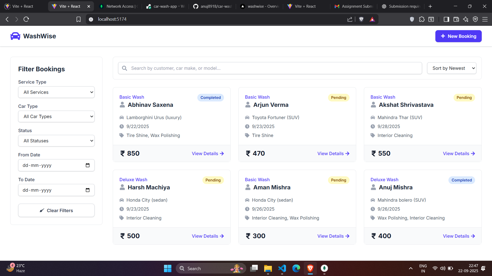
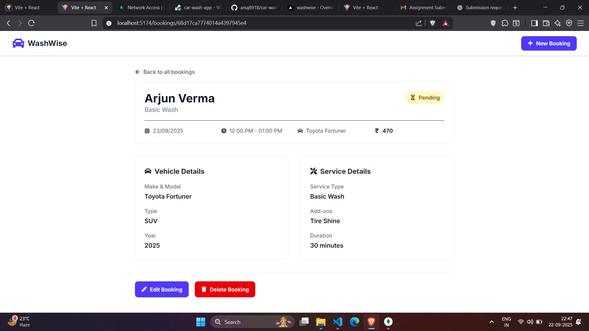
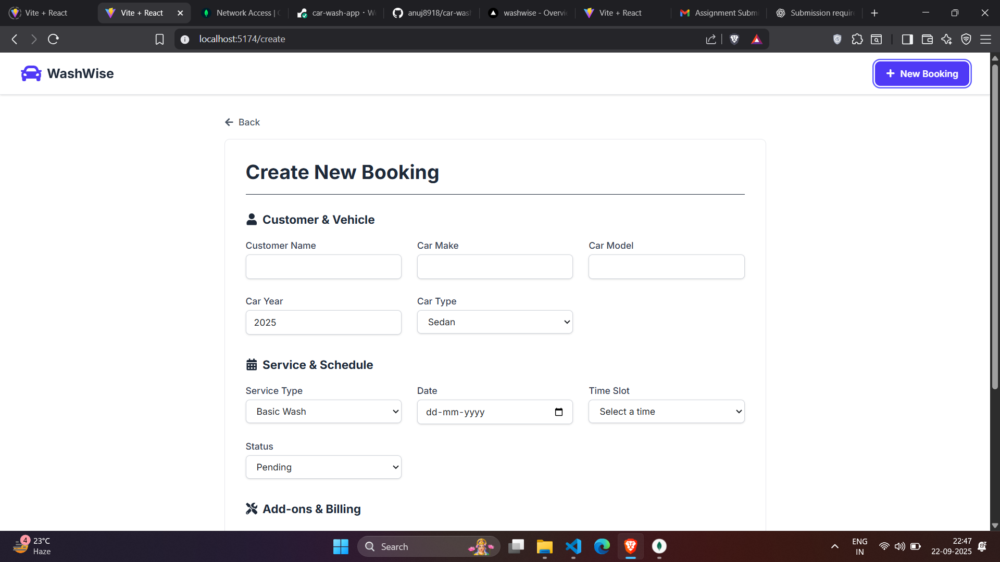
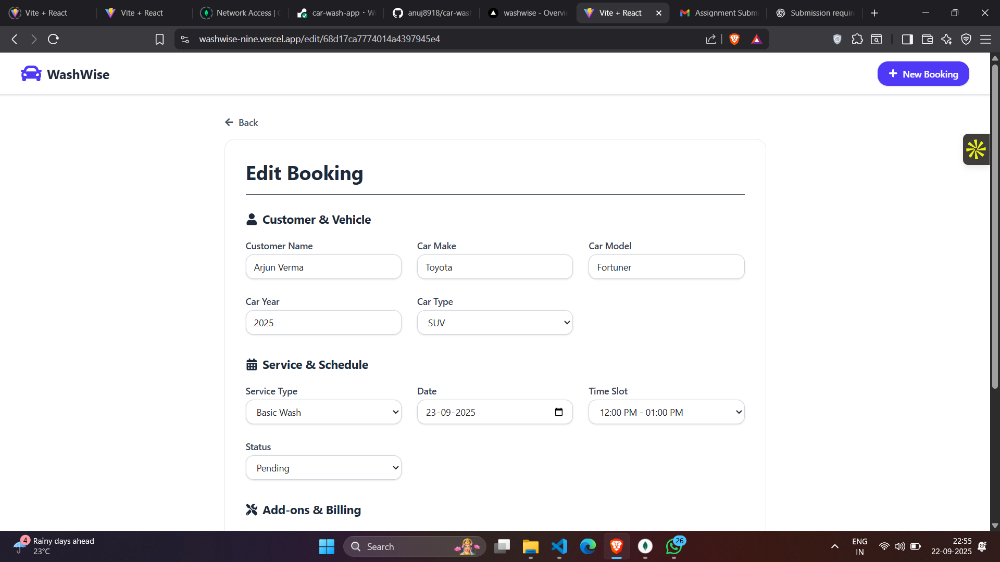
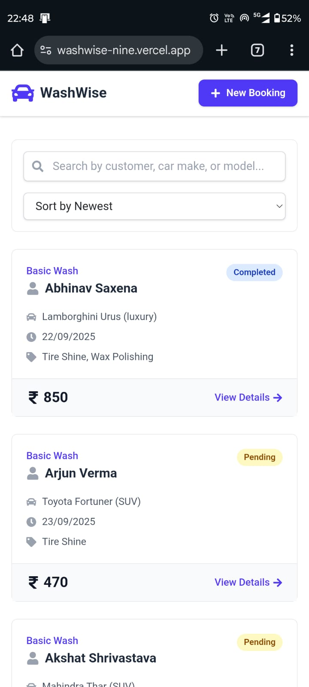
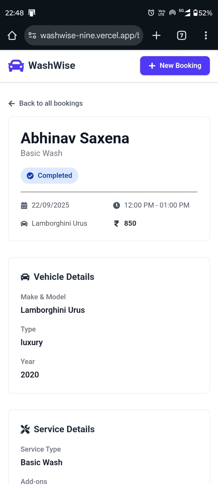
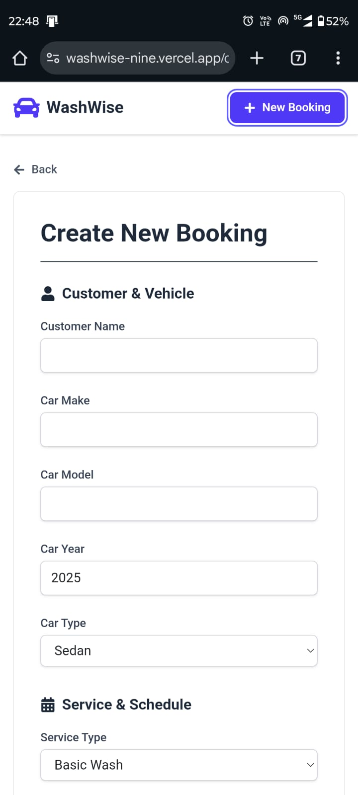
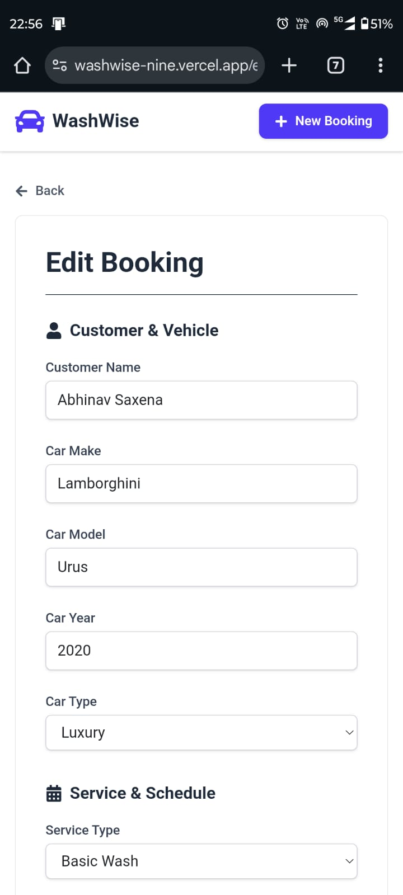

# 🚗 Car Washing Booking – MERN Stack

## 📖 Project Description

A **MERN stack web application** to manage car washing service bookings. Users can add, view, edit, delete, and search bookings. The app supports filters, responsive design, and pagination.

This project was built as part of the **MERN Assessment**.

---

## ✨ Features

* ➕ **Add Booking** (customer, car, service, time, price, status)
* ✏️ **Edit Booking** with pre-filled form
* ❌ **Delete Booking** with confirmation
* 📋 **View All Bookings** in card/grid view with pagination (8–10 per page)
* 🔍 **Search** by customer name & car details (real-time)
* 🎯 **Filter** by service type, car type, status, and date range
* 📱 **Responsive Design** – works on both desktop and mobile

⚠️ Features not implemented: Rating system, Invoice print, QR/Share booking.

---

## 🛠 Tech Stack

**Frontend:** React, React Router, Axios, Tailwind CSS
**Backend:** Node.js, Express.js
**Database:** MongoDB with Mongoose
**Others:** CORS, dotenv, body-parser, morgan

---

## ⚙️ Installation & Setup

### 1️⃣ Clone the repository

```bash
git clone https://github.com/anuj8918/car-wash-app
cd car-wash-app
```

### 2️⃣ Backend Setup

```bash
cd server
npm install
```

Create `.env` file in server:

```
MONGO_URI=your_mongo_connection_string
PORT=5000
```

Start backend:

```bash
npm start
```

### 3️⃣ Frontend Setup

```bash
cd client
npm install
npm run dev
```

---

## 📸 Screenshots

### Desktop

* Homepage
* Booking Detail
* Add Booking
* Edit Booking
* Search Results

### Mobile (2 views)

* Homepage Mobile View
* Booking Detail Mobile View

```markdown
## 📸 Screenshots

### Desktop Views





### Mobile Views




```

---

## 🌐 Live Demo

* **Frontend:** [WashWise](https://washwise-nine.vercel.app/)
* **GitHub Repo:** [Car Wash App](https://github.com/anuj8918/car-wash-app)

---

## 🐞 Known Issues / Limitations

* No authentication (open access).
* Rating, invoice printing, and QR/Share booking not implemented.
* Filters work, but performance could be improved with MongoDB indexes.

---

## 📌 Sample Data

* Different car types: Sedan, SUV, Hatchback, Luxury
* Service types: Basic Wash, Deluxe Wash, Full Detailing
* Statuses: Pending, Confirmed, Completed, Cancelled
* Mix of past, present, and future bookings
